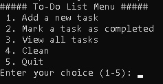

# To-Do-List
A python implementation of a simple "To Do List" program

## Dependencies
1. Git - https://git-scm.com/downloads
2. Python - https://www.python.org/downloads/

## Installation
1. Choose a folder where to download it
2. Open Git Bash in it
3. Type or copy & paste: git clone https://github.com/iivanov444/To-Do-List

## Usage
Open Terminal(Windows: PowerShell, Linux: Bash, MacOS: Terminal)
and type or copy & paste: python main_program.py

## Features
1. Add a new task
2. Mark a task as completed
3. View all tasks
4. Clean (cleans the Terminal window by adding new lines, it does not clear/refresh it in case the user forgot something important in the Terminal buffer)
5. Quit

## Examples
(In the program the output is different)
Adding new task: 1

Enter task editing: add

Enter a task: walk the dog

Enter a task: buy groceries

Enter a task: take out dishes from dishwasher

Enter a task: done

To exit, use command 'exit'
To enter task editing, use command 'add'
exit

Cleaning the Terminal buffer by adding spaces: 4

Viewing all tasks: 3

Quitting the program: 5

## License
MIT License
